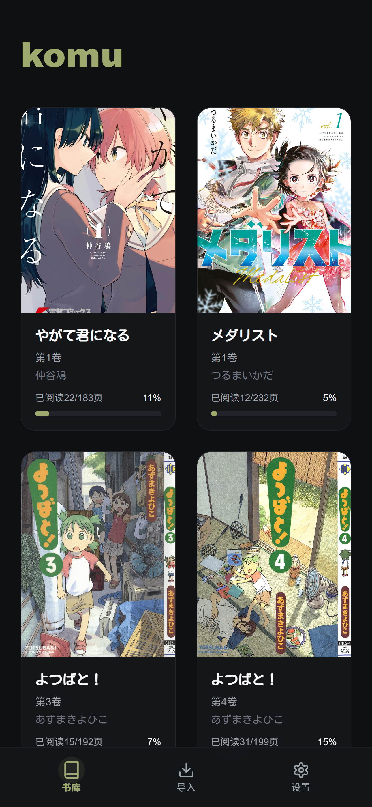
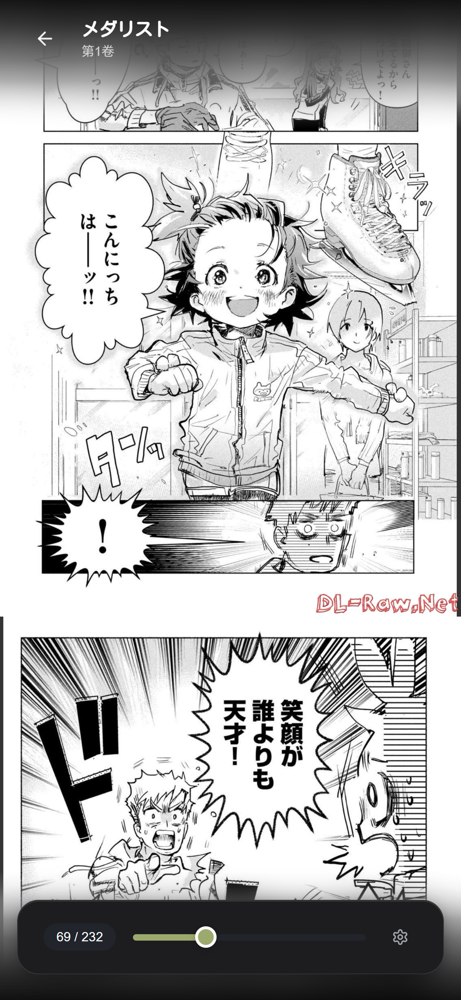
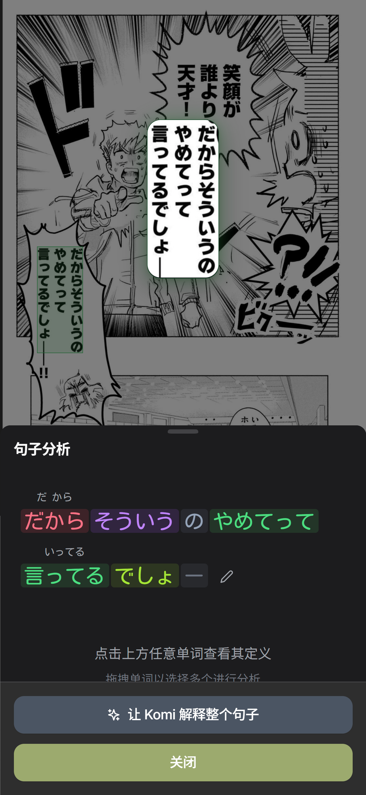
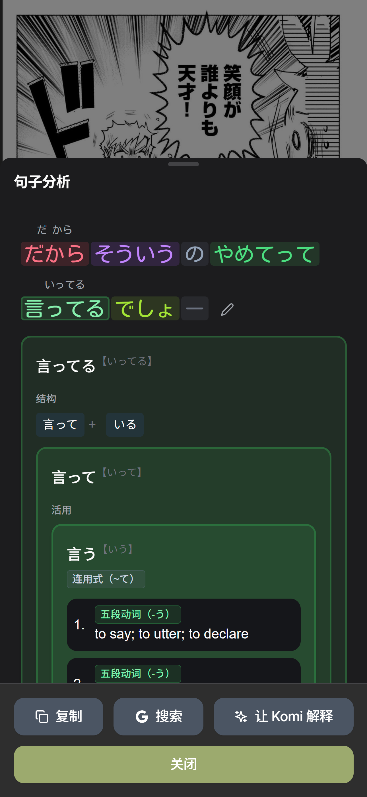
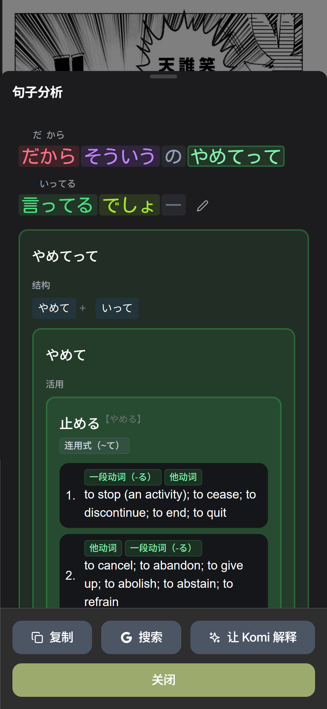
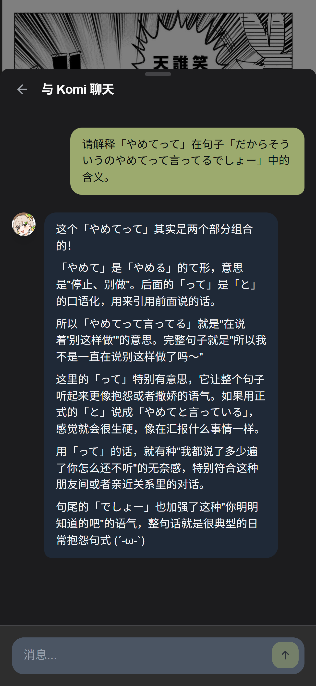

# komu

<div align="center">
  
  
  **A kawaii self-hosted manga reader for Japanese learning! Supports English and Chinese.**
  
</div>


<div align="center">
  








</div>

## Features

- **Import PDFs/Images**: Drag & drop manga PDFs/images to add to your library
- **Dialogue OCR**: Dialogue text recognition in the background (using [manga-ocr](https://github.com/kha-white/manga-ocr))
- **Grammar Breakdown**: Break down the dialogue into tokens with furigana and part-of-speech highlighting (using [ichiran](https://github.com/tshatrov/ichiran))
- **AI-driven Q&A**: Select words and ask Komi (our kanban girl) to explain them in the context of the dialogue
- **Responsive UI**: Works on both desktop and mobile
- **3 Reading Modes**: RTL/LTR page navigation and vertical scrolling
- **PWA Support**: Can be added to home screen as an app on both iOS and Android

## Tech Stack

- **Frontend**: React 18 + Vite + shadcn/ui + framer-motion
- **Backend**: Elysia + Bun + SQLite + Prisma
- **Japanese Tokenization**: [ichiran](https://github.com/tshatrov/ichiran)
- **OCR Inference**: FastAPI + [manga-ocr](https://github.com/kha-white/manga-ocr) + [comic-text-detector](https://github.com/dmMaze/comic-text-detector)

## Quick Start

### Installation

**Linux / WSL**

1. Install Docker following the instructions on the [official website](https://docs.docker.com/engine/install/ubuntu/#install-using-the-repository).

2. Run the following commands to install Git LFS, Bun, and ImageMagick.

```bash
# Install Git LFS
sudo apt install git-lfs

# Install Bun
curl -fsSL https://bun.sh/install | bash

# Install ImageMagick
sudo apt install imagemagick graphicsmagick
```

3. Clone the repository and install dependencies.

```bash
# Setup project (Important: --recurse-submodules to clone submodules in the packages folder!)
git clone --recurse-submodules https://github.com/TigerHix/komu.git
cd komu

# Install frontend & backend dependencies
cd frontend && bun install && cd ..
cd backend && bun install && bunx prisma generate && bunx prisma db push && cd ..

# Create Python virtual environment for inference service
# Need to create at the project root directory!
python -m venv .venv
source .venv/bin/activate
cd inference && pip install -r requirements.txt && cd ..
```

4. Copy the `backend/.env.example` file to `backend/.env` and fill in the values.

```bash
cp backend/.env.example backend/.env
```

To use the LLM-powered features, request an API key from [OpenRouter](https://openrouter.ai/) and add it to the `.env` file. You may also customize the LLM model (`CHAT_MODEL`, `SEARCH_MODEL`).

5. Copy the `inference/.env.example` file to `inference/.env` and fill in the values.

```bash
cp inference/.env.example inference/.env
```

**Windows & macOS**

**TODO.** Should be highly similar to the above.

### Running the Application

**Linux / WSL**

```bash
# Terminal 1: Frontend  
cd frontend && bun run dev

# Terminal 2: Backend
cd backend && bun run dev

# Terminal 3: Inference Service
cd inference && ./start_service.sh
```

⚠️ **First-time setup note**: The initial Docker build & run for ichiran (grammar analysis service) takes approximately 5 minutes. Grammar breakdown features will become available once you see "✅ Ichiran service ready!" in the console. If the build exceeds 10 minutes, please check if the build is stuck or increase the timeout in [backend/src/lib/ichiran-service.ts](backend/src/lib/ichiran-service.ts).

## Contributing

This project is pretty much vibe-coded in a few days so beware of the code quality! We invite you to vibe together using [Claude Code](https://www.anthropic.com/claude-code). Just don't spend too much money on it...

## License

Everything except Komi's visual assets are licensed under the [GPL-3.0](LICENSE).

Character Designer & Illustrator: [@凛星Rin](https://weibo.com/u/3533612514)